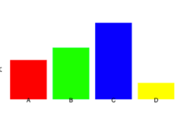
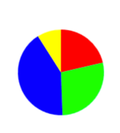
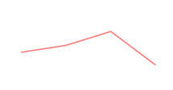

# Chart Module
This module consists of three smaller modules each representing a specific chart: BarChart, PieChart and LineChart. Usage information can be found at the corresponding submodule README.md file. 

# Project Information

This project aims to create a chart module that lets you draw four different charts to
help visualize data quick and easy.

## BarChart
[BarChart](./src/barchart/README.md)
The BarChart submodule is responsible for drawing a BarChart on a canvas element using the canvas api. 

## PieChart
[PieChart](./src/piechart/README.md)
The PieChart submodule is responsible for drawing a PieChart on a canvas element using the canvas api.

## LineChart
[LineChart](./src/linechart/README.md)
The LineChart submodule is responsible for drawing a LineChart on a canvas element using the canvas api.

## Releases
[V.1](https://github.com/ZakariasB/1DV610-L2/releases/tag/V1)
